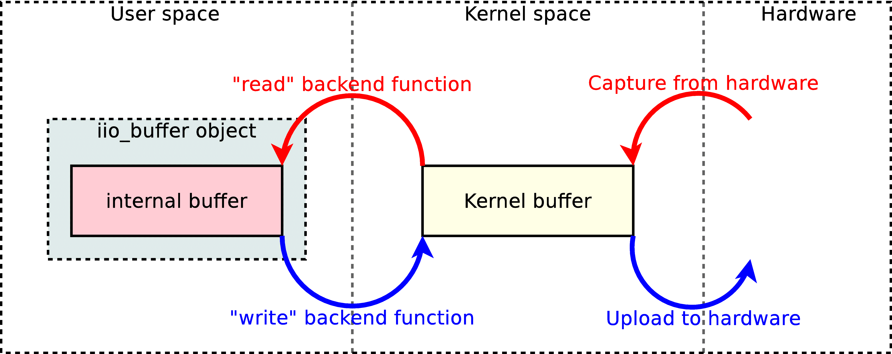
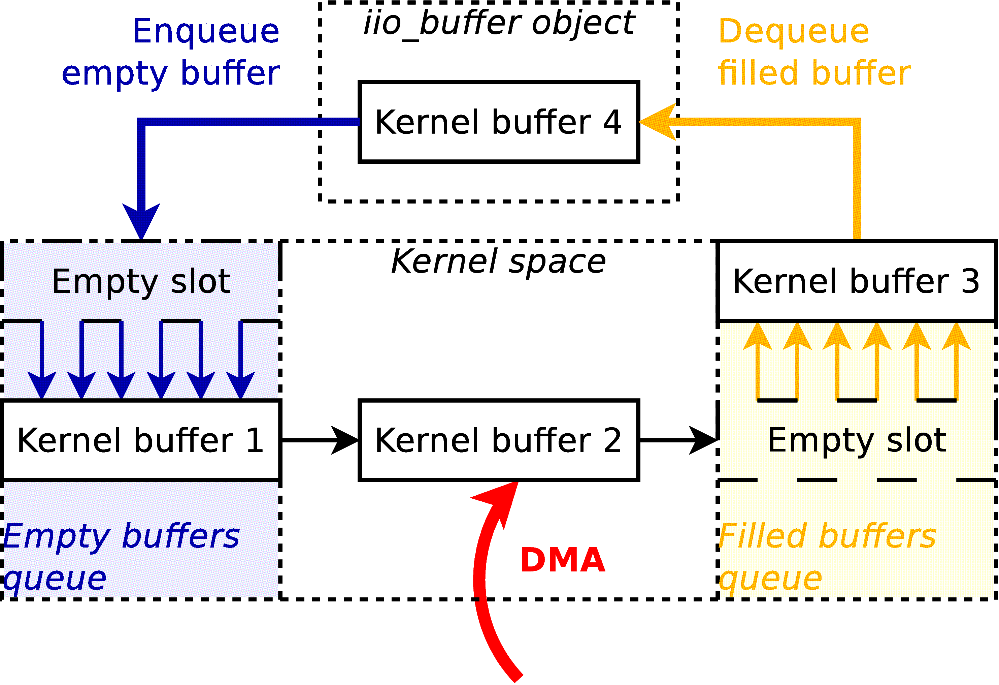
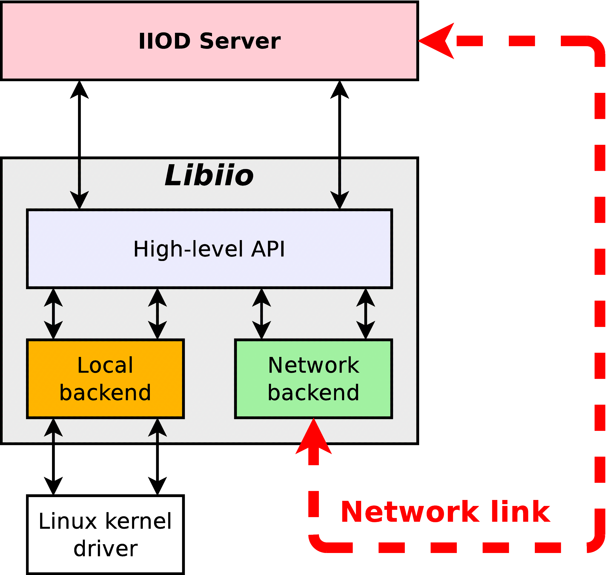
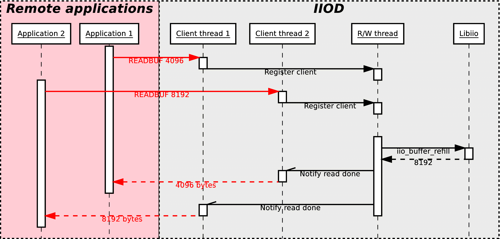
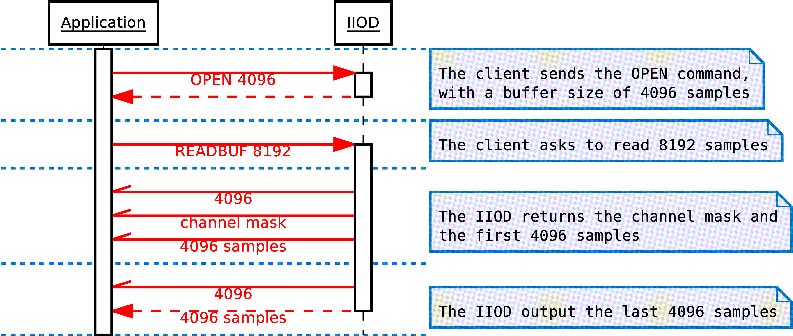
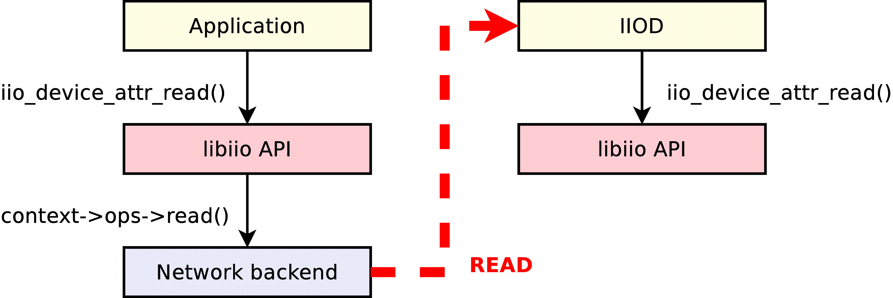
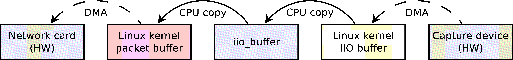
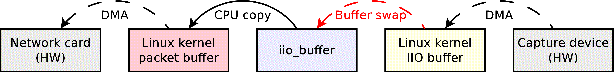
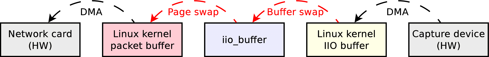

# Theory of Operation

## Objectives

Why did Analog Devices develop libiio?
To answer that question, it is needed to understand the state of things before libiio was introduced.

### Simplification and standardization

The Linux kernel features a IIO subsystem, which provides a standardized interface with the
user-space for client applications. The various drivers designed to interface different IIO devices
register with the IIO subsystem. As a result, all supported devices can be used by user-space
applications with the same interface.

At least, that\'s the theory. The reality is more complex; the interface provides different ways to
read or write a device, each driver generally implementing only the oldest and slowest method. The
various drivers will also create slightly different files in the sysfs filesystem of Linux, where all the
virtual files used to configure the interface are present.

As a result, before libiio was born the applications using IIO devices would generally be
designed to support only one particular device, because it was too much work to support several at a
time. Because of this, a lot of applications had their own code to interface with the kernel\'s IIO subsystem leading to maintenance issues. Furthermore, it was very difficult for customers to
create applications to use their hardware since they had to continuously rewrite the interface code or adapt it
from a pre-existing application.

The objective behind libiio is to ease the development process of applications using IIO devices,
by letting the new library be the intermediate between the program and the kernel.

By cleverly identifying devices, available input or output channels, libiio allows one application
to support a wide range of devices. For instance, if the application requests one device that features
a capture channel without specifying its name, then it will be compatible with all IIO devices with
at least one capture channel that exist to date, as well as future hardware that has yet to be invented.

### Advanced features

Beyond resolving issues, libiio was also announcing new features. The major planned
improvement being a network backend, which would broaden the set of possibilities: running the
applications as a single user, reading one IIO device from different applications, and of course use a
device from anywhere in the network in an application.

That network backend was also opening questions about other possible improvements: for
instance, using IIO devices from applications running on different operating systems, like Windows,
using those devices in environments like [GNU Radio](https://wiki.analog.com/resources/tools-software/linux-software/gnuradio), [MATLAB](https://wiki.analog.com/resources/tools-software/mathworks) or [Simulink](https://wiki.analog.com/resources/tools-software/mathworks), etc.


## License and code management

libiio has been developed and is released under the terms of the GNU Lesser General Public
License, version 2. This open-source license allows anyone to use the library for proprietary or
open-source, commercial or non-commercial applications. This choice was motivated by the fact
that Analog Devices is a company that principally sells hardware, and this library provides the
clients with a better and easier way of using this hardware.

The full terms of the license can be found here: <http://opensource.org/licenses/LGPL-2.1>

## Code conformance

A good part of libiio fully complies with the C99 and POSIX standards, and should be
compilable on any POSIX-compliant operating system supported by a C99 compiler. The exception
is the local backend, which is Linux-specific and thus can only be compiled for Linux systems.
The library can also be compiled under Visual Studio, which does not fully support C99 (in
2014\...), by preferring ANSI C89 when it makes sense. As the conformance to C99 and POSIX was
a design decision since the beginning of the project, porting the library to Windows has been
exceptionally easy and required very little change, thanks to the recent POSIX sockets compatibility
layer provided in Windows.

## Code visibility

While the public API declares and references iio_context, iio_device, iio_channel and iio_buffer
objects, their content is never known to the client application. All the public functions use pointers
to opaque structures:

``` c
struct iio_context;
__api void iio_context_destroy(struct iio_context *context);
```

In this example, the content of the iio_context structure is never listed, but the
iio_context_destroy function accepts a pointer to an instance of that structure as a parameter. This
design choice has several benefits:

-   The client applications are not able to modify directly the content of the objects; they must use the public functions of the API instead. This prevents the applications to mess with the internals of the library.
-   As the client applications manipulate only pointers, the structure of the object can change from one version of the library to another without breaking the ABI (binary interface). As a result, an old program compiled with an old version of the library will run just fine with a new version of the library, even if the structure of all the objects changed in the new version. This brings a lot of flexibility, as a client software isn\'t bound to one specific version of the API.

On top of that, the functions that compose the API of libiio are all prefixed with "\_\_api". This
token marks the corresponding functions as visible in the library. The functions that are not marked
are considered hidden and will not be callable from outside the library. This ensures that client
applications cannot call internal functions, and use the API functions instead.

## Backends

The libiio library has been designed from the start to support multiple backends. The current 0.1
version features three different backends: a XML backend, a local backend, a network backend.
Concretely, a backend is assimilated with a iio_context object. For each backend, one function in
the public API allows the creation of the corresponding iio_context object:

``` c
__api struct iio_context * iio_create_local_context(void);
__api struct iio_context * iio_create_xml_context(const char *xml_file);
__api struct iio_context * iio_create_xml_context_mem(const char *xml, size_t len);
__api struct iio_context * iio_create_network_context(const char *host);
```

The iio_context object contains a pointer to a iio_backend_ops structure:

``` c
struct iio_backend_ops {
    ssize_t (*read)(const struct iio_device *dev, void *dst, size_t len, uint32_t *mask, size_t words);
    ssize_t (*write)(const struct iio_device *dev, const void *src, size_t len);
    ...
};
```

This structure contains a set of function pointers that correspond to low-level functionalities:
read an attribute, open a device, stream data\... Those functions are specific to the backend used. For
instance, the "read" function pointer will be empty with the XML backend (as it does not support
streaming data), point to a function to retrieve a buffer full of freshly captured samples from the
Linux kernel with the local backend, or point to a function to send a read request via the network
with the network backend.

One thing to consider is that it is not a requirement to have all the backends enabled for the
library to work. For instance, the Windows versions are built without the local backend, as this one
is Linux-specific; and a build of the library meant to run on a development board with IIO devices
attached could be compiled without the network and XML backends, as those would be unused.

## Layering

The libiio library is built with two distincts layers. The top layer contains the implementations of
all the public functions. It is high-level, in the sense that those functions can be used independently
of the backend that was used to create the iio_context object. Those functions only use the content
of the various objects of the context, and rely on the functions provided by the backend in its
"iio_backend_ops" structure to perform any low-level operation. Those backend-specific functions
form the bottom layer of the library.

Here is a short example, extracted from the source code of libiio, that shows how the functions
that compose the public API of the library can call the backend-provided functions to perform
operations:

``` c
int iio_device_close(const struct iio_device *dev)
{
    if (dev->ctx->ops->close)
        return dev->ctx->ops->close(dev);
    else
        return -ENOSYS;
}
```

The iio_device_close function is part of the public API. What it does, is just call the "close"
function provided by the backend if available. Of course, this function\'s implementation is very
simple, but some other high-level functions perform much more than just a call to a backend
function.

The direct consequence of having proper code visibility and layering, is that one application that
use the libiio library and that was designed with the local backend, will work remotely through the
network just by changing one line of code: create the iio_context object with
iio_create_network_backend instead of iio_create_local_backend. All the functions that the
application will call will have the exact same effect, but with a different behaviour.

## The XML and local backends

### The XML backend

One of the first things implemented in the library has been the XML backend. Using this
backend, it is possible to generate a libiio context from a pre-existing XML file with a specific
structure. This backend has been very handy in the beginning of the development process, for the
simple reason that it simplifies the task of validating the code model: a XML file generated from the
code model with the iio_context_get_xml public function must be parsable, usable by the XML
backend, and result in the exact same objects being re-created.

The XML backend is the simplest backend. For instance, it does not provide any low-level
function to read or write attributes, or stream data. The full C code of this backend fits in around
360 lines, so it is extremely small. It uses the libxml2 library, available under Unix operating
systems as well as Windows and with a compatible license (LGPL) to validate then parse the XML
file.

#### Document Type Definition

```xml
    <?xml version="1.0" encoding="utf-8"?>
    <!DOCTYPE context [
        <!ELEMENT context (device)*>
        <!ELEMENT device (channel | attribute | debug-attribute)*>
        <!ELEMENT channel (scan-element?, attribute*)>
        <!ELEMENT attribute EMPTY>
        <!ELEMENT scan-element EMPTY>
        <!ELEMENT debug-attribute EMPTY>
        <!ATTLIST context name CDATA #REQUIRED>
        <!ATTLIST device id CDATA #REQUIRED name CDATA #IMPLIED>
        <!ATTLIST channel id CDATA #REQUIRED type (input|output) #REQUIRED name CDATA #IMPLIED>
        <!ATTLIST scan-element index CDATA #REQUIRED format CDATA #REQUIRED scale CDATA #IMPLIED>
        <!ATTLIST attribute name CDATA #REQUIRED filename CDATA #IMPLIED>
        <!ATTLIST debug-attribute name CDATA #REQUIRED>
    ]>
```

This DTD corresponds to the format expected by the XML backend of the latest libiio. It is
always embedded at the top of the XML generated with iio_context_get_xml, and the XML backend
will verify that the given XML file validates with the embedded format and issue an error if it\'s not
the case.

The format of the XML evolved quite a lot during the development phase of the library, to reflect
the new features implemented in the process. The "scan-element" and "debug-attribute" elements,
for instance, were added very late in the development phase.

### The local backend

The central and most complex piece of the libiio library is the local backend. This may be the
single most important part of the library, as it is the only part that will actually interact with the
hardware through the sysfs interface of the Linux kernel.

#### Creation of the context from sysfs

The first task, when creating the local backend, has been to implement the function
iio_create_local_context, the one responsible for the creation of the top-level iio_context object.
The implementation of this functionality represents maybe half of the complexity of the local
backend. To understand why, let\'s have a look at how the generation of the objects from sysfs
works.

Here is a list of files that can be found inside /sys/bus/iio/devices 1 :

    1:    /sys/bus/iio/devices/iio:device0/name
    2:    /sys/bus/iio/devices/iio:device0/out_voltage0_V1_raw
    3:    /sys/bus/iio/devices/iio:device0/out_voltage0_V1_scale
    4:    /sys/bus/iio/devices/iio:device0/out_voltage0_V1_powerdown
    5:    /sys/bus/iio/devices/iio:device0/out_voltage0_V1_powerdown_mode
    6:    /sys/bus/iio/devices/iio:device0/out_voltage1_V2_raw
    7:    /sys/bus/iio/devices/iio:device0/out_voltage1_V2_scale
    8:    /sys/bus/iio/devices/iio:device0/out_voltage1_V2_powerdown
    9:    /sys/bus/iio/devices/iio:device0/out_voltage1_V2_powerdown_mode
    10:   /sys/bus/iio/devices/iio:device0/out_voltage_powerdown_mode_available
    11:   /sys/bus/iio/devices/iio:device0/sampling_rate
    12:   /sys/bus/iio/devices/iio:device0/scan_elements/in_voltage0_en
    13:   /sys/bus/iio/devices/iio:device0/scan_elements/in_voltage0_index
    14:   /sys/bus/iio/devices/iio:device0/scan_elements/in_voltage0_type
    15:   /sys/bus/iio/devices/iio:device0/scan_elements/in_voltage1_en
    16:   /sys/bus/iio/devices/iio:device0/scan_elements/in_voltage1_index
    17:   /sys/bus/iio/devices/iio:device0/scan_elements/in_voltage1_type

The local backend will perform the following steps:

-   **Identify the IIO devices that can be used**. In this case, only one device is present, so one single iio_device object will be created, with the ID "iio:device0" and the name corresponding to the text contained in the "name" attribute (line 1).
-   **Identify the various channels for each devices**. In this example, the device features four different channels: two output channels with the IDs "voltage0" and "voltage1", and two input channels with the IDs "voltage0" and "voltage1". Note that the IDs can be the same as long as their direction is opposed, which is the case here. The correct way to identify a channel is by looking at their ID and their direction.\
    The two output channels also have a name: "V1" and "V2". Having a name is optional, that\'s why the two input channels don\'t have any.\
    Note that the two input channels are located in a sub-directory called "scan_elements". All the files present in that directory correspond to channels which support streaming (either capturing samples from the device for input channels, or submitting samples to the device for output channels).
-   **Identify the channel-specific attributes**. For instance, each one of the two output channels will have the "raw", "scale", "powerdown" and "powerdown_mode" attributes, most likely containing distinct values.
-   **Identify the attributes shared by all channels**. In this example, the two output channels will share one "powerdown_mode_available" attribute; if one channel modifies the content of the attribute, it is modified for all the channels of the device that have this attribute.
-   **Identify the device-specific attributes**, so the ones that don\'t apply to channels at all. In this case, this device has one attribute named "sample_rate". In theory, it also has the "name" attribute, but this one is not registered as an attribute in the iio_device object.

Additionally, the local backend will also add "debug attributes" to any device whose ID is found in the /sys/kernel/debug/iio directory. Those attributes can be assimilated to device-specific attributes, their only specificity is that they may not be available all the time. This directory being only browsable by the "root" super-user, they may be found only if the application is started with super-user rights.

#### Parsing issues

Although the kernel interface has been designed to be simple, it has not been designed to be
parsable. Let\'s take an example:

    1:    /sys/bus/iio/devices/iio:device0/out_voltage0_V1_raw
    2:    /sys/bus/iio/devices/iio:device0/out_voltage0_V1_scale
    3:    /sys/bus/iio/devices/iio:device0/out_voltage1_V2_raw

The name of the "voltage0" channel is correctly detected as being "V1", and the two "raw" and
"scale" attributes are detected properly. However, for the channel "voltage1", it is not possible to
differentiate the channel name with the attribute name: maybe the name is "V2" and the attribute
name is "raw", but maybe the channel has no name and the attribute is named "V2_raw"\...

The sad fact is that there is no easy way to address this issue; it has been avoided so far, as
channels often have more than one file in sysfs and rarely have names. The issue is still present in
the latest version of libiio, and will probably be worked around by using a database to map the
filenames in sysfs to the corresponding device, channel and attribute.

The issue becomes even more complex if you consider that the filenames can include "modifiers". The modifiers are known tokens in filenames, the local backend of the library uses a built-in list of modifiers to parse the filenames better.

    /sys/bus/iio/devices/iio:device0/in_voltage_blue_sample_rate

In that example, "blue" is a known modifier. "sample" could be the channel\'s name, or part of the attribute name. Note that the channel has no number, which is a pointer that a modifier is used. If the word following "voltage" is not recognized as a modifier, then the attribute is considered not to be a channel attribute, but a device attribute.

## Reading and writing

### Enabling channels

The first thing to do to read or write samples to the hardware, is to enable channels. This can be
done using the public function iio_channel_enable:

``` c
void iio_channel_enable(struct iio_channel *chn)
{
    if (chn->is_scan_element && chn->index >= 0 && chn->dev->mask)
        SET_BIT(chn->dev->mask, chn->index);
}
```

Note that this function does not perform any operation on the hardware, as it is not a backend
function. Instead, it marks the channel as enabled within its parent iio_device structure. The real
operation of enabling or disabling the channels is performed by the backend, in its "open" function.

### Creating a buffer

The second step, is to create a buffer bound to the device that will be used. This can be done with
the public function iio_device_create_buffer:

``` c
__api struct iio_buffer * iio_device_create_buffer(const struct iio_device *dev, size_t samples_count, bool cyclic);
```

-   The "dev" parameter corresponds to the iio_device object that will be used.
-   The "samples_count" will set the size of the kernel\'s internal buffer. The value set should correspond to the amount of samples that will be asked in each read or write operation.
-   The "cyclic" variable is used to inform the kernel whether or not the device is to be opened in cyclic mode. In this configuration, the first buffer of samples pushed to the hardware will be repeated continuously. This will be explained later.

Internally, the iio_device_create_buffer will call the backend\'s "open" function, defined with the following prototype:

``` c
struct iio_backend_ops {
    int (*open)(const struct iio_device *dev, size_t samples_count, uint32_t *mask, size_t words, bool cyclic);
    ...
};
```

The "dev", "samples_count" and "cyclic" parameters are the same as above. The "mask" and "words" parameters are new and shall be explained. The "mask" variable points to an array of 32-bit words. The exact number of words it contains is set in the "words" variable. Each 32-bit word of the array is a bitmask: if the bit Y of the word X is set, then the channel numero (32 \* X + Y) is enabled. Typically, a device doesn\'t have more than a handful of channels, so the "words" variable will almost always be set to 1. But the library must be able to handle even devices with more than 32 channels. Those bits are set or cleared with iio_channel_enable and iio_channel_disable,
respectively; that\'s why it\'s important to call those functions before creating a buffer.

### Reading and writing, the old way

In the infancy of the libiio library, there was no iio_buffer class. Instead, there were functions to
open/close and read/write a device: iio_device_open, iio_device_close, iio_device_read, etc. It
worked fine for a start, but was also severely limited, for several reasons:

-   There is no guarantee that the channels that were marked as disabled in the device\'s channel mask can actually be disabled. As a matter of fact, the stream that we read from the hardware can contain samples for channels that we did not request, and when emitting data, the hardware may expect more samples than what we\'re sending.
-   The iio_device_read and iio_device_write copy the stream, between the kernel\'s internal buffer and userspace. That is fine for slow devices, not for high-speed analog to digital converters that can produce 30 million samples per second (240 MiB/s worth of data) on a board with a 400 MHz CPU (like the ZedBoard).
-   Those read/write functions worked with the same sample format that the hardware manipulates, so the samples had to be converted to a format that can be processed after being copied from the kernel buffer, which resulted in an enormous overhead.

### Reading and writing with the iio_buffer class

The iio_buffer object addresses all those issues by providing a smarter API, and encapsulating a
part of the complexity. The iio_buffer object offers several possible methods to read or write
samples:

-   If you just want to dump the content of the internal buffer, you can just use the functions iio_buffer_start and iio_buffer_end to get the start and end addresses of the buffer, and then use the standard memcpy function to dump a part or the totality of the buffer.
-   Use iio_buffer_first, iio_buffer_step and iio_buffer_end to iterate over the samples of one given channel contained inside the internal buffer:
    ``` c
    for (void *ptr = iio_buffer_first(buf, channel); ptr < iio_buffer_end(buf); ptr += iio_buffer_step(buf)) {
        /* ptr points to one sample of the channel we're interested in */
    }
    ```

    This method can be very useful if the data of a channel has to be processed sample by sample, as in this case, there is no copy to an intermediate buffer. As the inner loops gets a pointer to the sample\'s emplacement, it can be used either to read or write the buffer.


<!-- -   Alternatively, the iio_buffer class contains a method called iio_buffer_foreach_sample. This function takes a function pointer as argument: the supplied callback will be called for each sample of the buffer. The callback receives four arguments: a pointer to the iio_channel structure corresponding to the sample, a pointer to the sample itself, the length of the sample in bytes, plus a pointer optionally set as argument of iio_buffer_foreach_sample. Again, this function can be used to read from or write to the buffer.\
    The main difference with the previous method, is that the callback is called for each sample of the buffer, in the order that they appear in the buffer, and not ordered by channels. As said previously, the buffer can contain samples of channels that we didn\'t request; the callback can just check whether or not the sample\'s channel is enabled with iio_channel_is_enabled, and just return zero if it\'s not. -->

-   The last method is to use one of the higher-level functions provided by the iio_channel class: iio_channel_read_raw, iio_channel_write_raw, iio_channel_read, iio_channel_write. The former two will basically copy the first N samples of one channel to/from a user-specified buffer (N depending of the size of this one buffer). Note that this function can be replaced with the first method and a memcpy (that\'s what it does internally, after all). The latter two will do the same, but will additionally convert all the samples copied from the raw format to the format that can be used by the applications.

### Refilling and submitting a buffer

It has to be noted that all the methods announced above will only work on the samples contained within the internal buffer of the iio_buffer class. In fact, two successive calls to iio_buffer_foreach_sample for instance will iterate over the very same samples twice. To obtain fresh samples from the hardware, it is required to call the function iio_device_refill. Needless to say that the previous content of the buffer is overwritten. On the other hand, to submit samples that were written inside the iio_buffer, it is possible to call the function iio_buffer_push. Those two functions will call either the backend\'s "read" or "write" functions, or if available, its "get_buffer" function (used in the local backend as a high-speed interface. We\'ll see about that later).

### Format conversion

As stated previously, the **iio_channel_read** and **iio_channel_write** functions convert the samples from/to their hardware format to/from the format of the architecture on which libiio is running. They actually simply call the iio_channel_convert and iio_channel_convert_inverse public API functions. These two deserve some explanations.

First, here is a textual representation of the hardware format as reported by the kernel:

    ># cat /sys/bus/iio/devices/iio:device0/scan_elements/in_voltage0_type
    le:s12/16>>4

What it says, is that the hardware samples are in little-endian order ("le"), that the sample size is 16 bits, but with only 12 bits worth of data. The "\>\>4" shift informs that those 12 bits are located after 4 most-significant bits (MSB), so in this particular case they correspond to the 12 less-significant bits (LSB), as 16 -- 4 = 12. The "s" character of "s12" means that the 12-bit value is signed.

From this hardware representation, the conversion functions will process the samples so that they become 16-bit unsigned values.

The conversion process may look like an easy task; however, the implementation is rather complex, for a good reason: it has been designed to handle samples of any possible size. It makes it possible to process 256-bit samples on a 32-bit CPU, for instance, while compilers typically don\'t handle numbers that large.

### Low-speed interface

The low-speed interface of the local backend was the first one to be implemented. It is also the simplest. It is composed by the four following backend functions:

``` c
struct iio_backend_ops {
    int (*open)(const struct iio_device *dev, size_t samples_count, uint32_t *mask, size_t words, bool cyclic);
    int (*close)(const struct iio_device *dev);
    ssize_t (*read)(const struct iio_device *dev, void *dst, size_t len, uint32_t *mask, size_t words);
    ssize_t (*write)(const struct iio_device *dev, const void *src, size_t len);
    ...
};
```

The prototype of the "open" function has been explained previously. In the local backend, when the low-speed interface is used, it will perform the following operations:

-   disable the internal kernel buffer (if it was enabled previously),
-   set the size of the kernel buffer, by writing the number of samples (given by "samples_count") inside the "buffer/size" attribute of the device (which corresponds to the file "/sys/bus/iio/devices/iio_deviceX/buffer/size"),
-   open the "/dev/iio:deviceX" file for reading and writing,
-   and finally, enable the channels which should be used by writing their "en" file (e.g. "/sys/bus/iio/devices/iio_deviceX/scan_elements/in_voltage0_en").

Then, the "read" and "write" backend functions will respectively read and write the "/dev/iio:deviceX" node. The stream manipulated contains samples in their raw format. Those two functions are used from within the iio_buffer class, when the application requests the buffer to be refilled with iio_buffer_refill or wants to submit a buffer full of data with iio_buffer_push. The data flow occurring with the low-speed interface can be explained with the following schema:

{.align-center width="600"}

When receiving from an input device (red arrows), the kernel will fill its internal buffer with new
samples, directly from the hardware using DMA transfers if the hardware supports it, or by reading
hardware registers (low-speed devices are generally connected with I2C or SPI). When an
application calls iio_buffer_refill, the samples contained in the kernel\'s buffer will be copied to the
iio_buffer\'s internal buffer, where they can be manipulated.

When streaming to an output device (blue arrows), the application will fill the iio_buffer\'s
internal buffer with samples then call iio_buffer_push, which will copy those new samples into the
kernel\'s buffer. Then, the kernel will transfer them to the hardware.

So what exactly makes it a low-speed interface? Between the kernel buffer and the iio_buffer
object, the samples are copied. On slow devices, it doesn\'t matter much. But on devices that can
function at very high frequencies, the overhead caused by the copying process is enormous. As
libiio is meant to be fast even on slow CPUs, a different approach was necessary.

### High-speed mmap interface

The high-speed interface is only implemented by the local backend, while the low-speed
interface is also supported by the network backend. It requires a very recent Linux kernel, and even
with that it is not supported by all kernel drivers. In the difference of the low-speed interface, it is
not implemented with the "read" or "write" backend functions, but with a function named
"get_buffer"; as such, one backend can provide both interfaces. This is the case for the local
backend, for instance.

The "get_buffer", as its name implies, retrieves a buffer from kernel space, or more specifically a
pointer to a buffer allocated in kernel space. The main difference of this interface, is that the kernel
manipulates not only one buffer, but a multitude of buffers. In the local backend, for instance, it
manipulates four buffers. For input channels, the "get_buffer" function will atomically query the
kernel for a new buffer with fresh samples, and push the old buffer back on the kernel\'s buffer
queue. For output channels, the principle stays the same, but the "get_buffer" function will
atomically query an empty buffer that the application can fill, and push the previous buffer that has
been written to.

Better than a wall of text, this schema sums up the principle of the high-speed interface:

{.align-center width="500" query="?500"}

Note that this schema represents a capture process. For an output process, just consider all the
arrows inverted.

Here is the prototype of the "get_buffer" backend function:

``` c
struct iio_backend_ops {
    ssize_t (*get_buffer)(const struct iio_device *dev, void **addr_ptr, size_t bytes_used);
    ...
}
```

-   As expected, the "dev" parameter corresponds to the iio_device object that will be used.
-   The "addr_ptr" is a pointer to the address of a buffer. The buffer pointed by "addr_ptr" will be enqueued to the kernel\'s queue, and "addr_pointer" will be changed to point to a new buffer. Note that the interface makes no difference between input and output devices, as in both cases a buffer is enqueued and a new one is dequeued.

Of course, it\'s always preferable to use the high-speed interface, when the driver allows it.
Internally, the iio_buffer object will first try to use the high-speed interface, and if it\'s detected as
not available, it will switch back to the old interface.

### Cyclic buffers

As stated previously, the iio_buffer class allows the creation of cyclic buffers, by setting the "cyclic" parameter of the function iio_device_create_buffer to True. In this case, the very first
buffer pushed (either with the slow interface or the newer high-speed interface) will be repeated
until the buffer is destroyed with iio_buffer_destroy. Once the first buffer has been pushed, any
subsequent call to the function iio_buffer_push will issue an error and return a negative error code.
This feature can be used to output a specific waveform, for instance.

Note that cyclic buffers only make sense for output devices. The "cyclic" parameter of the
iio_device_create_buffer function will simply be ignored when the related device is a capture
device.

## The network backend and IIO Daemon

### Conception of the IIO Daemon

#### Why a network backend?

Before libiio even existed, it was already decided that the library had to have a network backend,
and this for several reasons:

-   The first reason is obviously to allow the applications using libiio to stream samples on the network to any connected device. This has some benefits, notably for debugging purposes, and it makes development easier as there is no need to cross-compile the libiio-powered applications anymore.
-   Previously, the applications developed at Analog Devices that were using the IIO subsystem were for the most part meant to run directly on the target boards, that are generally equipped with weak CPUs in comparison to regular workstations. While those target do the job when it comes to transferring samples, they are not suitable for processing them, especially at a high speed. It may appear counter-intuitive, but streaming the samples via the network to a more powerful workstation allows to use a much higher sample rate without having samples lost.
-   Even when used locally, via the "lo" virtual network interface, a network backend makes sense. While the use of the local backend would result in a higher throughput and less resource usage, the IIO interface of the Linux kernel does not allow for more than one process or thread to access the same device at the same moment. By connecting two clients to the IIO daemon, which serves the requests from the network, it is possible for both of them to receive a copy of the stream of samples. This becomes extremely interesting, as it is now possible for instance to monitor the input stream received by a given application with the IIO Oscillator software (or any other suitable tool).
-   Finally, the network backend brings security. For advanced features, the applications using libiio with its local backend require super-user rights, which may not be suitable. When the network backend is used, the same features are available without super-user rights: the applications connect to and dialog with the IIO daemon, which possesses the super-user rights and properly exposes the advanced features to its clients.

#### Challenges

Developing the IIO Daemon (IIOD) has been the most challenging part of the project; most of
the complexity of the library is concentrated in this program. To understand why, let\'s see a short list
of the various characteristics of IIOD:

-   It is a network daemon. As such, it has to handle and manage incoming connections. Doing a network daemon properly means handling several clients in parallel, handling client disconnections without crashing, leaking memory or in more general terms leaving the daemon in a bad state. It also has to survive a network failure, disconnect unresponsive clients after a given timeout, etc.
-   To each connected client corresponds a thread in the server, that will interpret the commands sent and answer accordingly. All those different threads will execute the very same panel of functions. This means that all those functions must be thread-safe, that is to say safe to use in a multi-thread context: accesses to global resources are protected using locking mechanisms, and avoided as much as possible, in favor of a per-thread context structure. Furthermore, to each opened device correspond one other thread, called in this document the read-write (R/W) thread. For instance, with 4 connected clients opening a different device each, the IIOD has 1+4\*2 = 9 threads running in parallel: one main thread, one client thread per application connected and one R/W thread per device opened.
-   It handles multiples clients using the same device at the same time. Each client receives a stream of samples corresponding to the channels requested; the daemon is in charge of duplicating the stream to the connected clients.

#### Far-distance view

{.align-center width="350" query="?350"}

One interesting characteristic of IIOD is that it actually uses libiio underneath. In a way, it is at
the same time a client application for the libiio library, as well as a component used by the library.
Each command of the interpreter of IIOD is backed by the corresponding API function of libiio; and
in the network backend, to each backend function corresponds one command within the IIOD
server. IIOD has been designed that way to avoid code duplication as much as possible, and to test
the validity and the robustness of the high-level API of libiio.

### The command interpreter

#### Flex, Bison

The command interpreter has been written using the popular GNU tools Flex and Bison, free and
open-source variants of the old Lex and Yacc tools. Those programs can be used to generate a lexer
and a parser from source files defining the commands and the behaviour of the interpreter. The
output consists in C files, that can then be compiled or cross-compiled along with the rest of the
source code of the IIOD server.

Using Flex and Bison ensured that the code base would stay small, smart and concise. Writing an interpreter from zero in pure C can be a difficult task, and often (if not always) transform in a big code bloat with plenty of space for bugs to hide. This is true especially in this case, where the interpreter is meant to be ran across multiple threads.

#### Protocol

In the version 0.1 of the IIOD server, the following commands are accepted:

    HELP
        Print this help message
    EXIT
        Close the current session
    PRINT
        Display a XML string corresponding to the current IIO context
    VERSION
        Get the version of libiio in use
    TIMEOUT <timeout_ms>
        Set the timeout (in ms) for I/O operations
    OPEN <device> <samples_count> <mask> [CYCLIC]
        Open the specified device with the given mask of channels
    CLOSE <device>
        Close the specified device
    READ <device> DEBUG|[INPUT|OUTPUT <channel>] [<attribute>]
        Read the value of an attribute
    WRITE <device> DEBUG|[INPUT|OUTPUT <channel>] [<attribute>] <bytes_count>
        Set the value of an attribute
    READBUF <device> <bytes_count>
        Read raw data from the specified device
    WRITEBUF <device> <bytes_count>
        Write raw data to the specified device
    GETTRIG <device>
        Get the name of the trigger used by the specified device
    SETTRIG <device> [<trigger>]
        Set the trigger to use for the specified device
    SET <device> BUFFERS_COUNT <count>
        Set the number of kernel buffers for the specified device

When started normally (not in debug mode), the IIOD will answer those commands by a numeric
code sent in plain text. This code corresponds to -22 (the value of -EINVAL) if the parser did not
understand the command. If the command has been properly parsed, the server will forward the
value returned by the underlying libiio function, like iio_device_close for the CLOSE command.

For some operations, in case the return code is strictly positive, the server will also send a
number of bytes of data defined by the value of the return code. This is the case for instance for the
PRINT, READ and READBUF commands.

On the other hand, the WRITE and WRITEBUF operations will require a certain number of
bytes to follow the command call; For those operations, this number must be specified as the
"bytes_count" parameter in the command. The client\'s thread will then ignore the given amount of
bytes and just route them to the underlying libiio function. Once all the bytes have been transferred,
the interpreter resumes its normal process.

### Sending and receiving samples

#### Opening a device

Opening a device from the network can be performed with the OPEN command.

    OPEN <device> <samples_count> <mask> [CYCLIC]

The client thread of IIOD that corresponds to the connected client will then register itself as a
potential customer for capturing or uploading samples.

-   If the client application is the first to open the given device, a new thread will be started: the read-write (R/W) thread. Its purpose is to monitor the list of registered clients for R/W requests, read or write the device, and if reading upload the captured data to all the clients requesting samples.
-   If the application requests reading and another application is also using the same device for reading, it means that the R/W thread is already started. In this case, the client thread of IIOD will register itself aside of the other application, and the R/W thread will upload the captured data to both.
-   If the application requests writing, but another application is already using the same device, an error code is returned. In theory, it should be possible to handle different clients writing to one single device if they are writing to different channels; but that has not been implemented yet.

As the local backend only allows one device to be opened by one process at a time, the R/W
thread is responsible for holding the iio_buffer object. When started, due to one client using the
OPEN command, it will call iio_device_create_buffer. If all the clients disconnected or used the
CLOSE command, the R/W thread will stop itself after destroying the buffer with
iio_buffer_destroy.

It is important to note that the iio_buffer object is also destroyed and recreated each time a new
client use the OPEN command. This is done for two reasons:

-   The number of samples requested to libiio must correspond to the highest number requested by the connected clients. This ensures that the buffer used within the IIO subsystem of the Linux kernel is of the right size, so that no samples will be dropped.
-   The channel mask requested to libiio must include all the channels requested by the various clients. For instance, if one application sends the OPEN command to use the channel 1, and a separate application sends this command to use the channel 2, then the R/W thread will re-create the iio_buffer object with a channel mask corresponding to the two channels being enabled. This is done to ensure that each client application will receive samples for each channel it requested.

{.align-center width="700" query="?700"}

#### The read/write thread

When an application is ready to capture or emit samples, it will send the READBUF or
WRITEBUF command (respectively) to the IIOD server, with the number of bytes to read or write
as parameter:

    READBUF <device> <bytes_count>
    WRITEBUF <device> <bytes_count>

The corresponding client thread will then mark itself as requesting samples to be transferred, and
then sleep while waiting for a signal from the R/W thread.

Periodically, the R/W thread will go through its list of registered clients. If the R/W thread
corresponds to an output device, then only one client can register at a time; when this client requests
samples to be written to the device, the R/W thread will copy the stream of samples inside the
iio_buffer object, and then use iio_buffer_push to submit the data to the hardware.

If one or more clients are requesting to read samples, the thread will call the libiio API function
iio_buffer_refill to fetch a set of fresh samples, and then upload them to each client.

{.align-center width="700" query="?700"}

As soon as the amount of bytes requested by one client thread has been transferred, it will be
awaken by the R/W thread, and will be passed a return code.

#### Data transfer

When one client is registered for writing, it will send the sample data right after the WRITEBUF
command. The number of bytes uploaded to the server must correspond to the number specified in
the WRITEBUF command. When receiving the data, the R/W thread will simply copy it into the
internal buffer of the iio_buffer object then call iio_buffer_push, until all the data has been
submitted to the hardware.

When one client is registered for reading, as explained previously, the R/W thread will first send
a return code. This value represents an error code if negative, or the amount of bytes that will be
transferred if positive or zero. Right after this value, if no error occurred, the channel mask will be
appended, followed by the data. If the number of bytes specified in the READBUF command is
superior to the size of the buffer, then the data is uploaded in separate chunks, each chunk
containing one return code followed by a number of bytes inferior or equal to the buffer size. This
makes sense, considering that the R/W thread can only refill one buffer worth of data, so it cannot
assume that more than one buffer of samples will be available.

{.align-center width="600" query="?600"}

A return code of zero is actually not an error code. It is used to notify the client application that
no more samples can be read in this READBUF command, and that a new READBUF command
should be used. This happens for instance when a new client registered, and the channel mask was
modified.

#### Server-side and client-side de-multiplexing

When only one client is registered for reading, the process of uploading is rather easy. The R/W
thread will just write the content of the iio_buffer\'s internal buffer to the socket of the client. But
this is different when multiple clients are registered for the same device, and try to access separate
channels; in this case, it is required to de-multiplex the samples.

The process of de-multiplexing consists in extracting the samples corresponding to a given
channel set, from a stream that contains samples for more channels. In libiio and IIOD, it exists in
two different forms:

-   Server-side de-multiplexing means that the algorithm is executed within the server itself. When uploading the captured data back to the client application, the R/W thread will only upload the samples that belong to channels that were enabled by the application. This has several advantages: the client receives only the samples it requested, and the network link usage is kept relatively low.
-   Client-side de-multiplexing means that the algorithm is executed by the client application. On that case, the IIOD server will upload the same buffer to all the clients who requested samples. This has a big negative impact on network usage, as the clients also receive samples of channels that weren\'t requested. Additionally, the applications have to handle the fact that they may obtain less worthy samples than the number they requested.\
    On the plus side, client-side de-multiplexing puts all the burden of the process to the clients, which results in a big win when looking at resource usage of the target board. This is especially true on relatively slow processors, which then become capable of streaming at a much higher throughput without losing samples (around ten times the speed on a 400 MHz board).\
    Furthermore, de-multiplexing is a very easy process for the application, thanks to the iio_buffer functions: iio_buffer_foreach_sample and the combo of iio_buffer_first / iio_buffer_step / iio_buffer_end will simply ignore the samples corresponding to channels that the application didn\'t enable. Provided that the application use one of those methods to read the samples (iio_channel_read / iio_channel_read_raw will work as well), and doesn\'t expect to receive the exact number of samples it requested, then it already supports both server-side and client-side de-multiplexing.

### The network backend

#### Sending and receiving commands

In comparison with the complexity of the IIOD server, the network backend of the library is
extremely simple. Each call to one of its backend function will result in a command being sent to
the IIOD server. The "open" backend function will send the OPEN command, the "read" function
will send READBUF, etc. The parameters passed to the backend functions are properly converted to
ASCII according to the schema that the IIOD understands. The code returned by the server will be
used as the return value of the backend function.

{.align-center width="500" query="?500"}

Considering that the IIOD also uses the public API of libiio, the network backend is completely
transparent: the backend functions behave just like their local backend counterpart. In theory, it
would be completely possible to make IIOD use the network backend, and chain two IIOD servers together!

#### Context creation

One interesting note about the network backend, is how it creates its context. Once the
application calls the API function iio_create_network_context, and the network link is established
with the IIOD server, the initialization function of the network backend sends the PRINT command
to the server. For the record, this command returns an XML string which represents the structure of
the whole IIO context as seen by the server. From that XML string, the network backend will
actually create a IIO context from the XML backend, using the public API function
iio_context_create_xml_mem. Then, it will just piggy-back its own set of backend functions to
replace the ones provided by the XML backend.

#### Zero-configuration

One late feature implemented in the network backend of libiio and in the IIOD server has been
the support of auto-configuration. If a NULL pointer is passed as the "hostname" argument of
iio_create_network_context, then the network backend will attempt to discover and establish a
connection to a IIOD server present on the network.

This feature depends on the Avahi zero-configuration software stack. It can be enabled by setting
the preprocessor flag HAVE_AVAHI to a non-zero value; the IIOD will then register itself to the
Avahi daemon if one is running on the target, and the network backend will query the local Avahi
server for a IIOD server to use.

## libiio, now and in the future

### Bindings

C is a good language, but not everybody is familiar with it; some people might prefer object-oriented languages, like Java or Python for instance. This is why we created bindings for the library, so that it can be used with different programming languages. The additional languages supported by libiio are now Python and C#.

\<note important\>Since v0.19 all bindings require explicit flags to be enabled during builds. Please reference the [build instructions](https://github.com/analogdevicesinc/libiio/blob/master/README_BUILD.md) to make sure the desired bindings are built and installed.\</note\>

#### Python bindings

The Python bindings were developed very early in the project to facilitate generating XML strings modeling IIO contexts in order to properly test the XML backend. They quickly became outdated as the project moved on, but were later greatly improved and should now be on par with the C# bindings.

To better understand the available calls consult the [bindings source](https://github.com/analogdevicesinc/libiio/blob/master/bindings/python/iio.py) and some available [examples](https://github.com/analogdevicesinc/plutosdr_scripts).

##### Installation

Since v0.21 the python bindings have been available through pypi, and therefore can be installed with pip:

    pip install pylibiio

\<note important\>Note that this will just install the bindings and will error if the library itself is not installed.\</note\>

##### PyADI-IIO

An additional module was created which leverages the libiio python bindings call [pyadi-iio](https://analogdevicesinc.github.io/pyadi-iio/). pyadi-iio is recommended if a device specific class exists for your [current hardware](https://github.com/analogdevicesinc/pyadi-iio/blob/master/supported_parts.md). However, since pyadi-iio uses libiio all the libiio python APIs are available in that module if needed.

#### C# bindings

The C# bindings in particular are fully functional and cover the whole panel of features that
libiio provides. Its API consists in the Context, Device, Channel and IOBuffer classes, each one
providing a couple of methods, that directly call their C counterpart:

``` csharp
namespace iio
{
    public class Device
    {
        public IntPtr dev;
        ...

        [DllImport("libiio.dll", CallingConvention = CallingConvention.Cdecl)]
        private static extern IntPtr iio_device_get_id(IntPtr dev);

        public string id()
        {
            return Marshal.PtrToStringAnsi(iio_device_get_id(dev));
        }
    }
}
```

In this example, if you call the id method on an object of type Device, as a result the C function
iio_device_get_id will be called. All the others methods implement a similar mechanism.

The C# bindings are especially interesting for Windows users, because they permit to use libiio
in a .NET application (with the network backend, of course). By using Mono, it is also possible to
use libiio in C# programs running on Linux.

### Future improvements

#### Zerocopy

The current version of the IIOD server is extremely fast, provided that client-side demultiplexing is used. On a weak 400 MHz CPU, it has no problems to stream samples at speeds of 3MSPS (3 million samples per second) without dropping a single one.

However, 3 MSPS is really far from the maximum capacity of the typical converters. The [AD-FMCOMMS3-EBZ](https://wiki.analog.com/resources/eval/user-guides/ad-fmcomms3-ebz/) board, for instance, can digitize at a speed up to 61.44 MSPS (time 4 channels, for a total of 245.76 MSPS) \... nearly 100 times faster. And the recent [AD-FMCDAQ2-EBZ](https://wiki.analog.com/resources/eval/user-guides/ad-fmcdaq2-ebz/) is capable of 1000 MSPS for dual 16-bit channels, which
represents a maximum transfer speed of 2000 MSPS, or 32.0 Gb/s.

So how to reach those extremely high speeds, with a 400 MHz CPU? That\'s where [Zero copy](https://en.wikipedia.org/wiki/Zero-copy)
comes in play. To understand what zerocopy is, and how useful it can be, let\'s quickly recall how the
IIOD uploads the samples from one device to a connected client:

-   When the low-speed interface is used, the samples are acquired from the hardware using DMA, and stored into a kernel buffer; the local backend of libiio will then use the CPU to copy the samples to the iio_buffer object, and then copy again to the packet buffer of the Linux kernel by writing the client\'s socket.\
    {.align-center width="600" query="?600"}

<!-- -   The high-speed interface works roughly the same, but the manual copy from the kernel\'s IIO buffer to the iio_buffer object is avoided by swapping the buffers from user space and kernel space. However, it is still required to write the buffer to each client\'s socket.\
    {.align-center width="600" query="?600"} -->

-   Then comes zerocopy. The principle, is to avoid the second manual copy of the samples, when the data is written to the socket. So how can this work? How is it possible to send data through the network, without writing the socket?\
    The answer is to be found deep inside the Linux kernel. A particular system call, named "[vmsplice](https://en.wikipedia.org/wiki/Splice_(system_call))", allows to "give" virtual pages of memory to the Linux kernel through a file descriptor. This trick, introduced in Linux 2.6.17, works by re-configuring the Memory Management Unit of the CPU. Let\'s say the buffer to write to the socket starts at address 0x4000; the vmsplice system call will map the exact same area to a different address in kernel space, e.g. 0x8000, so that the buffer can be addressed from both addresses. Then, it will re-map the original 0x4000 address to point to a different physical location. As a result, a complete buffer of samples has been moved to kernel space, without copying a single byte of it! Then, from the hardware to the network link, the CPU never has to copy anything, and the 400 MHz ARM board can push hundreds of megabytes of samples on the network while having a CPU usage staying close to zero.\
    {.align-center width="600" query="?600"}\
    While vmsplice moves the pages to kernel space, it is also possible to duplicate them using the "tee" system call, and serve the same data to multiple clients connected to the IIOD server without using the CPU at all once again.\
    This very interesting feature of the kernel doesn\'t come without drawbacks: the address and the size of the buffer must be aligned to the page size for it to work. It is also uncertain how the IIO drivers within the Linux kernel would cope with this feature; but that is certainly something that will be attempted in the future.
